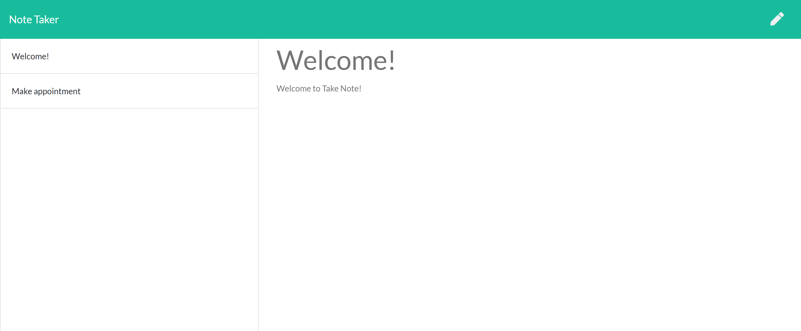

# Take Note 
   
  ===========================================
    
  ## Description 
      This note taker uses an Express.js back end to save and retrieve notes entered into the front end. The front end was made by modifying provided starter code.  All data is saved and retrieved from a JSON file.  
  ## Table of Contents 
  - [Installation](#installation)
  - [Usage](#usage)
  - [Contributions](#contributions)
  - [Questions](#questions)
  - [License](#license)
  ## Installation 
      No istallation is necessary to access this app.
  ## Usage 
To use this app, visit the heroku site [https://sleepy-badlands-81508.herokuapp.com/](https://sleepy-badlands-81508.herokuapp.com/).  On the landing page, you will click on the get started button to reach the main page.  All titles for previously saved notes will appear on the left of the page. To view these notes, click on the title and the note will appear to the right.  To write a new note, click on the pen to start a new note.  Select the save icon to save the new note.  It should then appear to the left. 

The repository can be found at [https://github.com/KellyJohnson364/take-note](https://github.com/KellyJohnson364/take-note)

  ## Contributions 
      This was created by:
* KellyJohnson364: [https://github.com/KellyJohnson364](https://github.com/KellyJohnson364)
            
            
            
         Feel free to contribute to this app.
           

   

  ## Questions 
If you have questions or feedback, please contact KellyJohnson364 at [https://github.com/KellyJohnson364](https://github.com/KellyJohnson364) or via email at KJ3641402@gmail.com.

## License
This project is licensed under The Unlicense.
For more info click [The Unlicense](./assets/licenses/theunlicense.md).